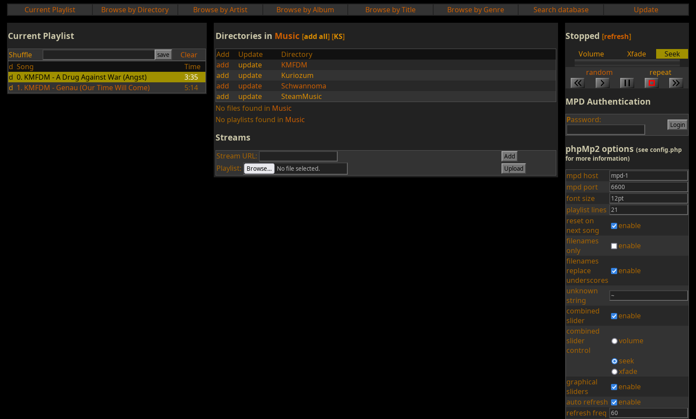

phpMp2
======

A web-based client for [MPD][] or [Mopidy][], written in [PHP][] as a replacement for phpMp.



A note from the author:
-----------------------
First, some history: This client was originally written in 2004-2005 by me,
[David H. Bronke](https://github.com/whitelynx), and was lost for many years because of lack of maintenance and
migration of the MPD codebase. I recently (late 2024) discovered a set of my backups that included 3 of the original
phpMp2 releases, and I decided to import them into Git and push the result to GitHub.

I figured I'd try out this 20-year-old project since I was releasing it to the public again, and it turns out it
**still works!** Even after upgrading to the latest versions of MPD and PHP (and even when trying Mopidy), the client
is still functional, only needing some minor bugfixes and quality of life improvements - most notably, a couple of new
Docker Compose stacks to make local use easier.

It's surprising and gratifying to see one of my earliest [open source](COPYING) projects still usable!

Using your own HTTP server and MPD/Mopidy server:
-------------------------------------------------

### Requirements:
- [MPD][] or [Mopidy][]
- nginx _(or any HTTP server of your choice that can run PHP)_
- [PHP][] 4.1 or higher
- GD support in PHP for graphical sliders

### Setup:
Download phpMp2 and extract into a directory on your webserver:

    tar xjvf phpMp2-0.12.0-rc2.tar.gz

Alternatively, you can use git to get the latest bleeding-edge version:

    git clone https://github.com/whitelynx/phpMp2

Edit `config.php`; This file contains numerous configuration options described
in the comments in the file.

Surf to the location of the extracted tarball with your web browser.

Using all-in-one MPD stack:
---------------------------
You can use the provided `docker-compose.yml` to run
[MPD][] and phpMp2 in [Docker](https://www.docker.com/).

Before running, create the `mpd-data/config`, `mpd-data/music`, and `mpd-data/playlists` directories:
```bash
mkdir -p mpd-data/{config,music,playlists}
```

You can place media files in the `mpd-data/music` directory.

Next, bring up the Docker Compose stack:
```bash
docker compose up
```

Finally, you can browse to <http://localhost:7080> to use phpMp2.

Using all-in-one Mopidy stack:
------------------------------
You can use the provided `docker-compose-mopidy.yml` to run
[Mopidy][] and phpMp2 in [Docker](https://www.docker.com/).

Before running, create the `mopidy-data/media`, `mopidy-data/local`, and `mopidy-data/playlists` directories:
```bash
mkdir -p mopidy-data/{media,local,playlists}
```

You can place media files in the `mopidy-data/media` directory and then index it with the `wernight/mopidy` image:
```bash
docker run --rm \
    --device /dev/snd --user 105:100 \
    -v "$PWD/mopidy-data/media:/var/lib/mopidy/media:ro" \
    -v "$PWD/mopidy-data/local:/var/lib/mopidy/local" \
    -v "$PWD/mopidy-data/playlits:/var/lib/mopidy/playlits" \
    -p 6680:6680 \
    wernight/mopidy mopidy local scan
```

Next, bring up the Docker Compose stack:
```bash
docker compose -f docker-compose-mopidy.yml up
```

Finally, you can browse to <http://localhost:7080> to use phpMp2.

Credits:
--------
- phpMp written by Warren Dukes (shank)
- phpMp2 written by David H. Bronke ([whitelynx](https://github.com/whitelynx);
  formerly nosferat)

Bugs:
-----
See `TODO` for information on known bugs that need to be fixed.
If you find a bug, please file an issue in
[this repository](https://github.com/whitelynx/phpMp2).

License:
--------
Ths code is released under the terms of the
[GNU General Public License v3.0](COPYING).

Changes:
--------
version 2b2r1 -> 0.11.0 (change in versioning to match MPD)
- too many changes to list, since there hasn't been a release in ages... now
  supports streams, playlist uploading, search, sort, browsing by tags, playlist
  IDs, graphical sliders, combined sliders, separate styles and layouts,
  on-the-fly configuration, and much more.

version 2b2 -> 2b2r1
- fixed the crossfade function for newest version of mpd.
- fixed bug in volume slider in frames layouts.

version 2b1 -> 2b2
- too many things to remember

version 0.9.1 -> 2b1
- complete rewrite


[MPD]: https://musicpd.org/
[Mopidy]: https://mopidy.com/
[PHP]: https://www.php.net/
